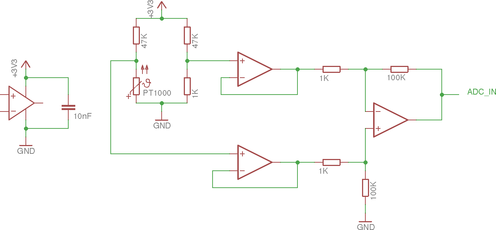
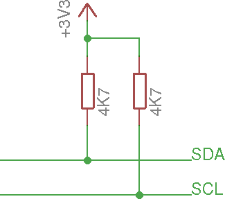

## Architektur des FPGA-Chips

Mithilfe der Hardwarebeschreibungssprache VHDL wurde die Architektur des Chips auf dem DE2-Entwicklungsboards beschrieben. Als IDE wurde Altera's Quartus verwendet. Simulationen wurden mit dem Programm ModelSim durchgeführt. Im Ordner `src` findet man die entsprechenden Projektdateien sowie den Quellcode.

Folgendes Blockschaltbild verdeutlicht leicht vereinfacht den Datenaustausch der einzelnen Entities:


Die zentrale Entity `invent_a_chip` steuert mithilfe der `gp_*` Signalen die Peripherie über ein Relaismodul. Die Kommunikation über den Datenbus I²C findet auch über GPIO-Pins mithilfe der `gp_*` Signalen statt. Dabei ist zu beachten, dass diese sowohl zum Schreiben als auch zum Lesen verwendet werden müssen, um die Sensoren richtig anzusteuern und auszulesen.

### 1. Auslesen der Sensoren

#### 1.1. Temperatursensor und CO2-Sensor

Sowohl Temperatur- als auch CO2-Sensor liefern dem DE2-Board einen analogen Wert, das heißt eine Spannung, die von dem Extension Board in einen digitalen Wert umgewandelt werden kann.

**Temperatursensor**

Bei dem Temperatursensor handelt es sich um einen PT1000 Thermistor, welcher bei 0°C einen Widerstand von 1kOhm hat. Dieser Thermistor hat einen positiven Temperaturkoeffizient, was beudetet, dass bei einer Temperaturerhöhung sich der Widerstand des Messwiderstandes vergrößert. Diese Änderung des Widerstandes ist annähernd linear und kann mithilfe der folgenden Verschaltung ausgelesen werden.



Der Platin-Messwiderstand befindet sich in einer [Wheatstone'schen Messbrücke](https://de.wikipedia.org/wiki/Wheatstonesche_Messbr%C3%BCcke). Bei einer Temperatur von 0°C beträgt die Spannungsdifferenz der Messbrücke 0V. Insofern eine höhere Temperatur erreicht wird, erhöht sich die Spannungsdifferenz, welche durch den rechten Operationsverstärker aufgrund der Widerstandsanordnung (1kOhm, 100kOhm) hundertfach verstärkt. Die mittleren Operationsverstärker dienen zur [Impedanzwandlung](https://de.wikipedia.org/wiki/Impedanzwandler). Die Operationsverstärker werden mit einer gepufferten 3,3V Spannung versorgt (ganz linkes Schaltbild).
Nach der hundertfachen Verstärkung durch einen Operationsverstärker kann die resultierende Spannung durch einen ADC (**A**nalog-to-**D**igital **C**onverter) in einen digitalen Wert umgewandelt werden. Die Auflösung dieses ADC sind 12-bit, das heißt bei Null-Potenzial beträgt der Wert 0, bei einer Eingangsspannung von 3,3V ist der digitale Wert 4095. Nach einer Messung bei Zimmertemperatur wurde der lineare Zusammenhang zwischen digitalem Wert und Temperaturwert in Celsius ermittelt. Mithilfe dieses Codes wird der eingelesene digitale Wert in die Einheit Temperatur umgewandelt:
```vhdl
heating_temp_nxt <= resize(shift_right(unsigned(temp_value) * 74043 + 131072, 18), heating_temp'length);
-- Beispiel: temp_value = 1200
-- 1200 * 74043 + 131072 = 88982672
-- 88982672 >> 18 = 339 (enspricht der Division mit dem Divisor 2^18 [= 262144])
-- 339 entsprechen 33,9°C
```

**CO2-Sensor**

Der CO2-Sensor hat einen Messbereich von 0-5000 ppm (**p**arts **p**er **m**illion). Dies entspricht einer Konzentration von 0 bis 0.5 Vol.-% Kohlenstoffdioxid in der Luft. In der Außenluft liegt dieser Wert bei ungefähr 350 ppm, in einem Zimmer zwischen 1000 und 2000 ppm.
Da der CO2-Sensor eine analoge Spannung zwischen 0.4 V und 2.0 V ausgibt, wird der Wert wie folgt im FPGA umgerechnet:
```vhdl
co2_nxt <= resize(shift_right((unsigned(co2_value) - 496) * 82539, 15), co2'length);
```
Die Konzentration von CO2 in der Luft des Gewächshauses soll rückschlüsse auf die Photosyntheseleistung der Pflanze ermöglichen, da bei diesem für die Pflanze lebenswichtigen Prozess Kohlenstoffdioxid benötigt wird. Bei einer guten Photosyntheseleistung müsste der Gehalt von CO2 innerhalb des abgeschlossenen Gewächshauses sinken. Damit wieder CO2 in die Luft des Gewächshauses gelangt, wird jede halbe Stunde "belüftet", um das Stattfinden der Photosynthese zu ermöglichen.

#### 1.2. Helligkeitssensor und Feuchte-Sensor

Sowohl der Helligkeitssensor als auch der Feuchte-Sensor kommunizieren über den weit verbreiteten seriellen Bus I²C. Dafür werden nur zwei Kabel (VCC und GND ausgenommen) benötigt, um die beidseitige Kommunikation vom Master (FPGA) zum Slave (Sensor) oder andersherum zu ermöglichen. Beide Sensoren kommunizieren über die Taktfrequenz 400kHz (fast mode) und werden mit 3,3V versorgt.
Außerdem muss der Clock- und Daten-Kanal mit einem Pull-Up Widerstand auf 3,3V "gezogen" werden. Geeignete Widerstandsgrößen sind liegen ungefähr zwischen 2,2kOhm und 10kOhm. Folgender Schaltplan veranschaulicht die Verschaltung des Bus:



**Helligkeitssensor**

technische Details: [TSL2561 Datasheet](https://raw.githubusercontent.com/SeeedDocument/Grove-Digital_Light_Sensor/master/res/TSL2561T.pdf).
VHDL-Implementierung: [Code/vhdl/modules/light_sensor.vhdl]()


Der Helligkeitssensor besitzt die Slave-Addresse 0x29 und wird jede Sekunde ausgelesen. Damit der Sensor einen Wert zurückgeben kann, muss dieser zuerst "eingeschalten" werden. Daraufhin wird eine Einstellung für das Auslesen geschickt und ein wenig gewartet, bis der Lichtsensor einen sinnvollen Wert an das DE2-Board schicken kann. Insofern alle Werte ausgelesen wurden, wird der Sensor wieder ausgeschaltet, um Strom zu sparen.
Die Tabelle soll den Kommunikation ablauf näher verdeutlichen:

| Register | Kommando | Beschreibung |
|----------|---------|--------------|
| REG_CONTROL (*0x80*)  | POWER_ON (*0x03*)  | aktiviert den Sensor |
|           -           | -                  | warte 400ms, damit der Sensor booten kann |
| REG_TIMING (*0x81*)   | HIGH_GAIN, INT_101 (*0x11*) | setzt Verstärkung auf 16x und Integrationszeit auf 101ms |
| -                     | -                  | warte 800ms, damit der Sensor liefern kann (Integrationszeit) |
| REG_CHANNEL0L (*0x8C*) | *kein Kommando-Byte* | Lesen des tiefen Bytes des ersten Kanals  |
| REG_CHANNEL0H (*0x8D*) | *kein Kommando-Byte* | Lesen des hohen Bytes des ersten Kanals   |
| REG_CHANNEL1L (*0x8E*) | *kein Kommando-Byte* | Lesen des tiefen Bytes des zweiten Kanals |
| REG_CHANNEL1H (*0x8F*) | *kein Kommando-Byte* | Lesen des hohen Bytes des zweiten Kanals  |
| -                     | -                  | Lux-Wert aus ausgelesenen Kanalwerten kalkulieren |
| REG_CONTROL (*0x80*)  | POWER_OFF (*0x00*)  | deaktiviert den Sensor |

Die Integrationszeit wird benötigt, damit der Helligkeitssensor aus den analogen Werten der Photowiderständen digitale Werte an das interne ADC-Register sendet, die integer sind. Außerdem müssen die Kanalwerte der unterschiedlich empfindlichen Photowiderstände in einen Lux-Wert umgewandelt werden, der Auskunft über die Helligkeit gibt - unabhängig von der Wellenlänge des Lichts.


Je nach Verhältnis der beiden Werte werden die einzelnen Kanalwerte, die zuvor je nach Integrationszeit mit einem Faktor (bei 101ms Integrationszeit circa `3,975`) skaliert werden, mit unterschiedlichen Koeffizienten multipliziert.
Um einen kritischen Pfad auszuschließen, wird der Lux-Wert in einer eigenen Entity über fünf Taktzyklen berechnet.

**Feuchte-Sensor**

technische Details: [TSL2561 Datasheet](https://raw.githubusercontent.com/SeeedDocument/Grove-Digital_Light_Sensor/master/res/TSL2561T.pdf).
VHDL-Implementierung: [Code/vhdl/modules/moisture_sensor.vhdl]()

Der Feuchte-Sensor wird jede Sekunde von dem DE2-Board ausgelesen und gibt einen 16-bit Wert an den Master zurück, der für gewöhnlich zwischen 300 und 700 liegt. Leider gibt es keine vergleichbare Einheit, die eine Aussage über die Bodenfeuchte geben kann, weshalb der Nullpunkt bei dem Wert 370 angenommen wird und der höchste Wert bei 600 liegen soll, was 100% entsprechen soll. Folgende Wertetabelle zeigt gemessene Referenzwerte:

| Zustand  | Werte (min.) | Werte (max.) |
|----------|---------|--------------|
| in Luft  | 300 | 320 |
| in trockener Erde | 365 | 375 |
| in normaler Erde | 400 | 440 |
| in feuchter Erde | 460 | 480 |
| in Trinkwasser | 590 | 600 |
| in gesättigter Kochsalz-Lösung | 670 | 680 |

Der Ablauf der Kommunikation zwischen Sensor und DE2-Board beginnt mit dem Senden eines Reset-Signales zur Initialisierung. Dieses Signal wird nur beim "ersten Start" oder nach betätigen des Reset-Knopfes gesendet. Jede folgende Kommunikation besteht nur aus dem Senden des zu lesenden Registers (1 Byte) und das Empfangen des Registerwertes (2 Byte).
Da die Implementierung in der Hardwarebeschreibungssprache VHDL sich an den [vom Hersteller vorgeschlagenem Beispielcode](https://github.com/Miceuz/i2c-moisture-sensor/blob/master/README.md#arduino-example) für einen Arduino orientiert, wird zwischen dem Senden des Registerbytes und dem Empfangen des Wertes 20ms gewartet siehe:

```c
unsigned int readI2CRegister16bit(int addr, int reg) {
  Wire.beginTransmission(addr);
  Wire.write(reg);
  Wire.endTransmission();
  delay(20);
  Wire.requestFrom(addr, 2);
  unsigned int t = Wire.read() << 8;
  t = t | Wire.read();
  return t;
}
```

### 2. Steuerung der Aktoren

Zum Ansteuern der Aktorik, die eine Spannung von 12V benötigen, wurde eine Relaismodul mit vier steuerbaren Relais verwendet. Die Relais an sich benötigen eine Spannung von 5V für den eingebauten Elektromagneten. Damit dies sich dennoch mit der Betriebsspannung des DE2-Boards 3,3V berträgt, ist auf dem Modul der Relaisschaltkreis mit einem Optokoppler vom Steuerschaltkreis getrennt. Hier der Schaltplan:


Der Schaltplan wurde aus den Angaben des Herstellers erstellt und enthält deshalb keine Widerstandsgrößen, weil keine Angaben darüber gefunden wurden. Damit der Elektromagnet im Relais anzieht muss logisch '0' ausgegeben werden, bei logisch '1' öffnet das Relais. Die Steuerung ist somit invertiert.

VHDL-Implementierung: [Code/vhdl/modules/peripherals.vhdl]()

**Stromverbrauch:**

| Aktorik | Stromstärke |
|----------|---------|
| Lüfter und Elektromagnet | - |
| Heizfolien | 2A |
| Pumpe | 700mA |
| Beleuchtung | 188mA |


Da die Pumpe zwar bei 12V läuft, jedoch manchmal nicht anläuft wurde mithilfe dieses [Step-Up Converter](https://www.amazon.de/Spannung-10-32v-Converter-Step-Up-Adjustable/dp/B00HV43UOG/ref=pd_sbs_23_2?_encoding=UTF8&psc=1&refRID=S9RD24657F1FBKV7JMSC) auf 24V geboostet. Damit gibt es keine Schwierigkeiten beim Anlaufen der Pumpe und eine zuverlässige Bewässerung ist garantiert.
