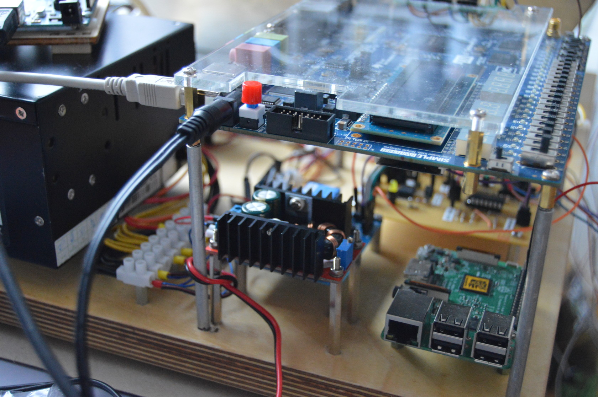
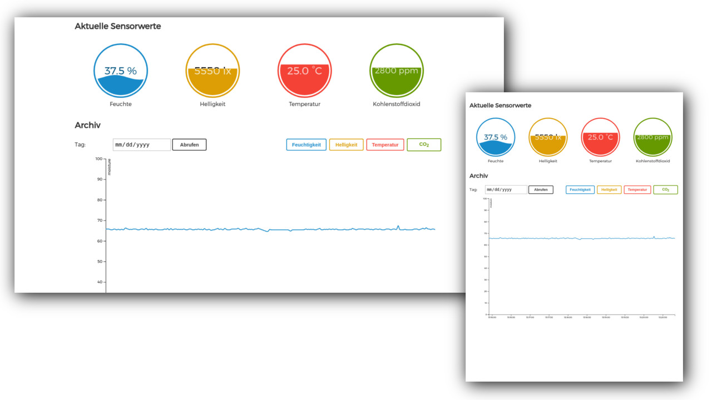

# LeafySan

LeafySan - ein vollautomatisiertes Gewächshaus gesteuert und überwacht durch einen FPGA-Chip. Dieses Projekt wurde im Zuge des bundesweiten Nachwuchswettbewerbes "Invent a Chip" im Jahr 2017 erstellt. Mithilfe der Hardwarebeschreibungssprache [VHDL](https://de.wikipedia.org/wiki/Very_High_Speed_Integrated_Circuit_Hardware_Description_Language) und einem DE2-Board von Altera wurde das Auslesen der Sensoren und Steuern der Aktoren umgesetzt. Des weiteren werden Sensordaten an einen Linux Mikrocomputer namens Raspberry Pi gesendet, welcher diese Daten speichert. Die Daten können auf mobilen Geräten wie Tablets oder Smartphones sowie Laptops im Browser abgerufen werden.

__FPGA Entwicklungsboard:__
* [Altera DE2-115 Board](http://www.terasic.com.tw/cgi-bin/page/archive.pl?Language=English&No=502)

__verwendete Sensoren:__
* [digitaler Helligkeitssensor (I²C)](http://wiki.seeed.cc/Grove-Digital_Light_Sensor/)
* [digitaler Feuchte-Sensor (I²C)](https://www.tindie.com/products/miceuz/i2c-soil-moisture-sensor/)
* [analoger Temperatursensor (PT1000 Thermistor)](https://www.reichelt.de/Sensorik-SMD-bedrahtet-/PCA-1-1505-10/3/index.html?ACTION=3&LA=446&ARTICLE=85054&GROUPID=8097&artnr=PCA+1.1505+10&SEARCH=PCA%2B1.1505%2B10)
* [CO2 Infrarot Sensor (0~5000 ppm)](http://www.komputer.de/zen/index.php?main_page=product_info&cPath=24&products_id=424)

__verwendete Aktoren:__
* [Lüfter (12V, 40x40mm)](https://www.reichelt.de/Luefter/FAN-ML-4010-12-S/3/index.html?ACTION=3&LA=446&ARTICLE=110411&GROUPID=7775&artnr=FAN-ML+4010-12+S&SEARCH=FAN-ML%2B4010-12%2BS)
* Wasserpumpe
* [2x Heizung (12V, 12W, 77x110mm)](https://www.conrad.de/de/polyester-heizfolie-selbstklebend-12-vdc-12-vac-12-w-schutzart-ipx4-l-x-b-110-mm-x-77-mm-thermo-532878.html)
* [2x LED-Streifen (jeweils 25cm Länge)](http://www.ledlager.de/led-streifen)

## Modell und Projektaufbau

Die Elektronik wurde auf einer Holzplatte mit Schrauben und Stelzen befestigt, damit bei einem Wasserleck nicht die sich auf dem Boden befindliche Elektronik beschädigt wird. Um die Funktionsweise der einzelnen Sensoren und Aktoren zu demonstrieren, wurde ein "Gewächshaus" angefertigt, das aus einem Aluminiumboden und einer Acrylglas-Haube besteht. Darin befindet sich Blumenerde, die von einem kleinen Schlauchsystem bewässert wird, sowie der Bodenfeuchte-Sensor, der die Feuchtigkeit des Boden nicht-kapazitiv misst. Außerdem wurde die Beleuchtung und Belüftungsmechanik (ein Elektromagnet öffnet/schließt eine Klappe, um den Gasaustausch mit der Außenluft zu ermöglichen) im Gewächshaus verbaut. Damit das Gewächshaus erwärmt werden kann, steht es auf einer Aluminiumplatte, welche durch zwei kleine 12V Heizplatten erwärmt werden kann.

Die noch notwendige Mess- und Steuerelektronik befindet sich auf einer Lochrasterplatine unterhalb des DE2-Boards, wo sich auch eine Relaiskarte mit vier steuerbaren Relais sowie der Mikrocomputer namens Raspberry Pi befinden.

Mehr Bilder gibt es in der [Bildergalerie](dokumentation/gallerie.md)

## Frontend

Das DE2-Board sendet über USB die aktuellen Sensorwerte an den Raspberry Pi 3. Der Mikrocomputer speichert aller fünf Sekunden die Sensorwerte des aktuellen Tages in einer CSV-Datei. Somit dient der Raspberry Pi als "Archiv" der Standortbedingungen der Pflanze und soll dem Nutzer darüber Aufschluss geben.
Damit man diese Werte einsehen kann und auch Archiv-Daten graphisch in einem Diagramm darstellen kann, wurde folgende Einstellungen an dem Raspberry Pi vorgenommen: *link*

An dieser Stelle großen Dank an [Phil Martins Tutorial "Using your new Raspberry Pi 3 as a WiFi Access Point"](https://frillip.com/using-your-raspberry-pi-3-as-a-wifi-access-point-with-hostapd/)

Nachdem der Pi als Access Point eingerichtet wurde, muss der Javascript Code des Servers mithilfe von NodeJS ausgeführt werden, damit das Frontend über den Pi erreichbar ist. Wenn alles richtig eingestellt und ausgeführt wurde, ist die Seite nach Verbinden mit dem Access Point des Pi's unter `http://192.168.2.1:8000` aufrufbar.
Das Design der Seite wurde auch für mobile Geräte, wie z. B. Tablets oder Smartphone jeglicher Bildschirmgrößen, optimiert.

[Mehr zur Umsetzung und zum Ausführen der Server Applikation](dokumentation/frontend.md)

## Stromversorgung

Damit das DE2-Entwicklerboard von Altera, sowie der Raspberry Pi 3 und die Aktoren mit ausreichend Strom versorgt werden, wurde ein altes ATX Computer-Netzteil modifiziert, um die Stromversorgung zu garantieren. Damit man die Versorgungsspannungen 3,3 V, 5 V und 12 V nutzen kann, musste jedoch die "Power Supply On" (Violett) Leitung mit Ground (Schwarz) verbunden werden, damit die 3,3 V (Orange), 5 V (Rot) und 12 V (Gelb) Schienen aktiv sind. Außerdem wurde ein 11W [Leistungswiderstand](https://www.reichelt.de/11-Watt-axial/11W-AXIAL-4-7/3/index.html?ACTION=3&LA=446&ARTICLE=1524&GROUPID=3120&artnr=11W+AXIAL+4%2C7&SEARCH=11W%2BAXIAL%2B4%252C7) mit 4,7 Ohm direkt innerhalb des Netzteilgehäuses fixiert und mit Ground und 5 V verbunden, damit eine Grundbelastung von ca. 1 A vorherrscht. Dies wird empfohlen, um das Netzteil richtig zu nutzen.
Welche Kabelfarben des ATX-Formates wofür stehen, kann man [hier](https://de.wikipedia.org/wiki/ATX-Format#Pinbelegung) einsehen.

Für folgende Komponenten wurden die benannten Versorgungsspannungen benötigt:

|    3,3 V                |     5 V         |    12 V                            |
|-------------------------|-----------------|------------------------------------|
| Temperatursensor        | Raspberry Pi 3  | LED-Beleuchtung                    |
| Feuchte-Sensor          | Relais          | Belüftung (Lüfter + Elektromagnet) |
| Helligkeitssensor       | CO2-Sensor      | Bewässerungspumpe                  |
| Relaisansteuerung       |                 | Heizung                            |

Teilweise wurden die 3,3 V auch vom DE2-Board abgegriffen. Dieses wird wiederum vom Netzteil mit 12V betrieben.

## Sponsoren

- [Creative Factory GmbH Großenhain](http://creative-factory-gmbh.de/)
- Sebastian Fischer, MdL (CDU)

